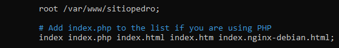

# BalanceadorCargaNginx
## Configuración de las máquinas virtuales
### Le asignamos las IPs y scripts a las máquinas

### A continución muestro los scripts

## MÁQUINA MYSQL
### cd /etc/mysql/mariadb.conf.d/
### sudo nano 50.server.cnf

### Dentro de archivo cambiamos lo siguiente, poniendo la IP de la maquina MYSQL

### Ahora ponemos una contraseña al root de el MYSQL
### sudo nano mysql_secure_installation

### Entramos a la base de datos
### Creamos el usuario, le damos privilegios y acabamos con un flush privileges

### Descargamos del gihub con el enlace el archivo

### Importamos la base de datos al MYSQL

## MÁQUINAS NGINX
# IMPORTANTE
## Los pasos mostrados deben de seguirse en ambas máquinas
### cd /var/www/
### sudo mkdir sitiopedro
### sudo chown www-data.www-data sitiopedro/

### Descargamos el archivo del github

### Entramos en la carpeta descargada
### cd src/
### sudo mv * /var/www/sitiopedro/

### Editamos el archivo config.php y ponemos la IP de la base de datos

### cd /etc/php/7.4/fpm/pool.d
### sudo nano www.conf

### Cambiamos la dirección que nos aparece en listen por la siguinete dirección

### Reiniciamos el php y hacemos una copia del default en el sites-available, además lo editamos

### Dentro del archivo cambiamos html por sitiopedro y despues de el primer index añadimos index.php

### Más abajo en el mismo archivo tenemos que descomentar las lineas como en la captura

### Creamos un enlace con el siguiente comando
### sudo ln -s /etc/nginx/sites-available/sitionginx /etc/nginx/sites-enabled/sitionginx
### Tambien borramos el default

### sudo nginx -t
### sudo systemctl restart nginx

## MÁQUINA BALANCEADOR
### cd /etc/nginx/sites-enabled/
### sudo rm default
### sudo nano conf.d

### Dentro del archivo que hemos creado añadimos lo siguiente, poniendo las IPs de los nginx

### Movemos el archivo hasta el sitio que le corresponde
### sudo mv /etc/nginx/sites-available/conf.d /etc/nginx/conf.d/confbalanceador.conf
